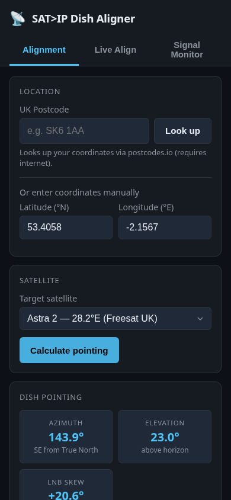
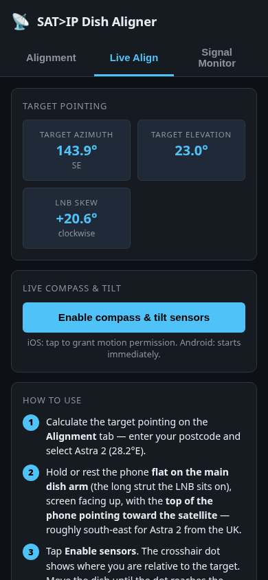
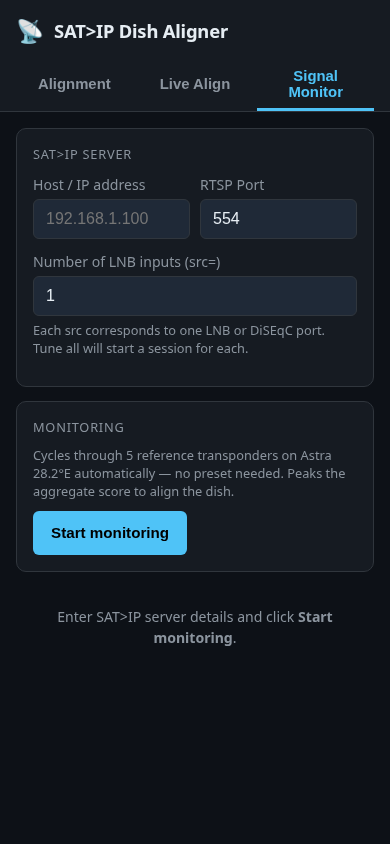

# 📡 SAT>IP Dish Aligner

> Mobile-friendly satellite dish alignment tool and live signal monitor.
> Talks directly to your SAT>IP device over RTSP — no TVHeadend required.

---

## Overview

**SAT>IP Dish Aligner** is a lightweight Flask web app you run on your home network.
Open it in a phone browser while standing at the dish and it gives you:

| Tab | What it does |
|-----|-------------|
| **Alignment** | Calculates azimuth, elevation and LNB skew for your location and chosen satellite. UK postcode lookup included. |
| **Live Align** | Uses the phone's built-in compass and tilt sensor to show real-time dish bearing vs. target, with a crosshair bubble display. |
| **Signal Monitor** | Connects to a SAT>IP server (e.g. minisatip) and polls live signal strength, lock status and quality across 5 reference transponders on Astra 28.2°E. |

---

## Screenshots

### Alignment tab



### Live Align tab



### Signal Monitor tab



---

## Features

- **No TVHeadend needed** — speaks SAT>IP RTSP directly (OPTIONS → DESCRIBE → SETUP → PLAY)
- **Aggregate scoring** — cycles 5 reference transponders (H/V, DVB-S/S2) and produces a single 0–100 dish score; peak it while adjusting the mount
- **Live sensor align** — phone compass + tilt drives a real-time crosshair; iOS permission prompt handled automatically
- **UK postcode lookup** — `postcodes.io` resolves a postcode to lat/lon in one tap
- **Multi-LNB / DiSEqC** — configure `src=` count to monitor each LNB input independently
- **Mobile-first dark UI** — works well with one hand on a phone outdoors
- **Transponder breakdown** — expand any LNB card to see per-transponder lock/signal/quality
- **minisatip compatible** — parses signal from the SDP `fmtp` attribute (minisatip v2.x)

---

## Requirements

- A SAT>IP server on your LAN (minisatip, Tvheadend SAT>IP plugin, Telestar DIGIBIT R1, etc.)
- Python 3.12+ **or** Docker

---

## Docker install (recommended)

### docker compose

```bash
git clone https://github.com/nmanfred/satip-align.git
cd satip-align
docker compose up -d
```

The app will be available at **http://&lt;host-ip&gt;:9081**.

`network_mode: host` is set by default so the RTSP client presents a real source IP to the SAT>IP device (some devices reject NAT'd transport addresses).

### docker run

```bash
docker run -d \
  --name satip-align \
  --network host \
  --restart unless-stopped \
  ghcr.io/nmanfred/satip-align:latest
```

### Environment variables

| Variable | Default | Description |
|----------|---------|-------------|
| `PORT` | `9081` | Port the Flask app listens on |

---

## Manual install

```bash
git clone https://github.com/nmanfred/satip-align.git
cd satip-align
python -m venv .venv && source .venv/bin/activate
pip install -r requirements.txt
python app.py
```

Open `http://localhost:9081` in your browser.

---

## Satellite catalogue

Pre-loaded satellites (editable in `app.py`):

| Satellite | Position |
|-----------|----------|
| Astra 2 (Freesat UK) | 28.2°E |
| Eutelsat 28A | 28.5°E |
| Astra 1 (Germany/Europe) | 19.2°E |
| Hotbird (Mediterranean) | 13.0°E |
| Thor/Intelsat (Nordic) | 0.8°W |
| Amos | 4.0°W |
| Atlantic Bird | 12.5°W |
| Telstar 11N | 37.5°W |

---

## Reference transponders (Astra 28.2°E)

The aggregate monitor cycles these five transponders to exercise both polarisations and modulation types:

| Label | Frequency | Pol | Symbol rate | Mode |
|-------|-----------|-----|-------------|------|
| 11425H | 11425.000 MHz | H | 27500 ksps | DVB-S |
| 11344H | 11344.000 MHz | H | 27500 ksps | DVB-S |
| 11778V | 11778.000 MHz | V | 27500 ksps | DVB-S |
| 10818V | 10817.500 MHz | V | 23000 ksps | DVB-S2 |
| 11671H | 11670.750 MHz | H | 23000 ksps | DVB-S2 |

---

## API

The Flask app exposes a small REST API consumed by the frontend:

| Method | Endpoint | Description |
|--------|----------|-------------|
| GET | `/api/postcode/<postcode>` | Resolve UK postcode → lat/lon via postcodes.io |
| GET | `/api/satellites` | List satellite catalogue |
| GET | `/api/presets` | List transponder presets |
| POST | `/api/signal/tune-aggregate` | Start aggregate monitoring session |
| GET | `/api/signal/aggregate-status` | Poll aggregate signal status |
| POST | `/api/signal/tune` | Start single-transponder sessions |
| GET | `/api/signal/status` | Poll single-transponder signal status |
| POST | `/api/signal/teardown` | Stop all active RTSP sessions |

---

## Project structure

```
satip-align/
├── app.py              # Flask routes and satellite catalogue
├── satip_rtsp.py       # SAT>IP RTSP client and signal monitor
├── templates/
│   └── index.html      # Single-page app (vanilla JS, no build step)
├── Dockerfile
├── docker-compose.yml
└── requirements.txt
```

---

## Suggested GitHub topics

`satellite` `satip` `sat-ip` `dish-alignment` `dvb-s` `dvb-s2` `freesat` `astra` `flask` `rtsp` `minisatip` `home-network` `self-hosted` `python`

---

## License

[CC BY-NC-ND 4.0](https://creativecommons.org/licenses/by-nc-nd/4.0/) — non-commercial, no derivatives, attribution required.
